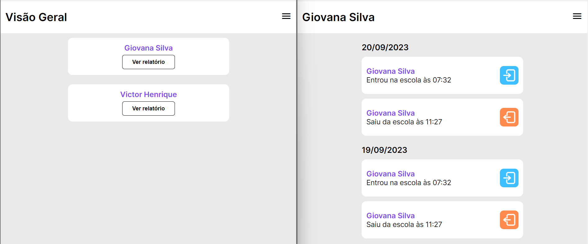

# template-catraca

## 🖥️ Projeto

Projeto Web Responsivo de uma tela de registro de catraca do Colégio Batista Mineiro. 

## 🚀 Tecnologias

Esse projeto foi desenvolvido com as seguintes tecnologias:

- HTML
- CSS 
- JavaScript
- Git e Github

